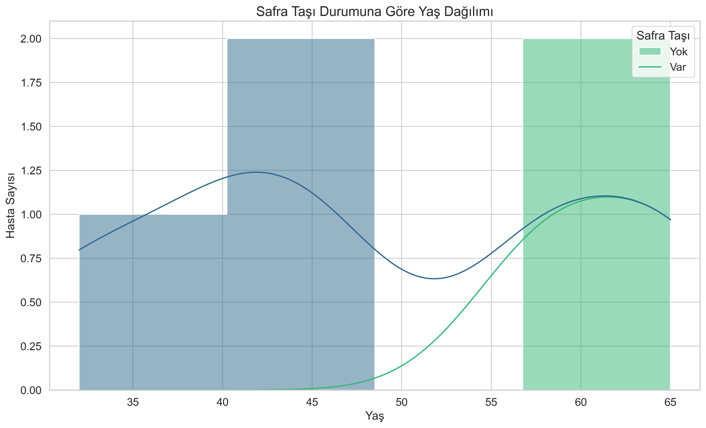
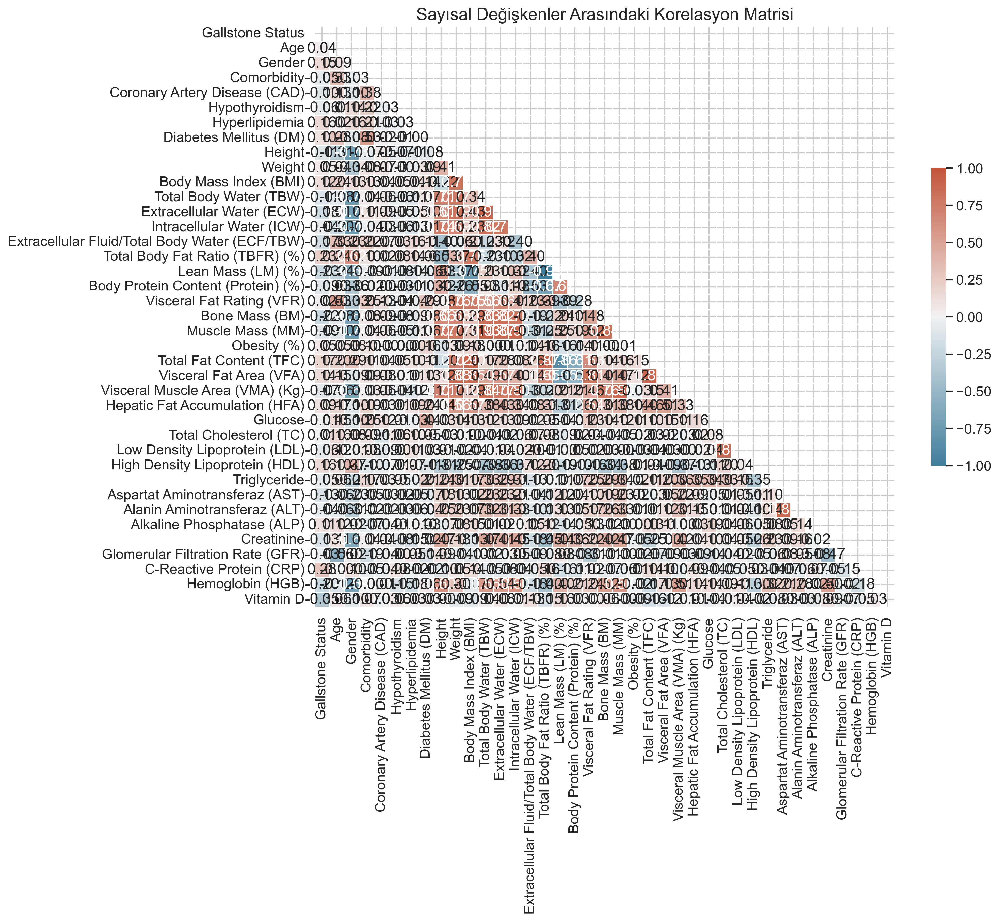
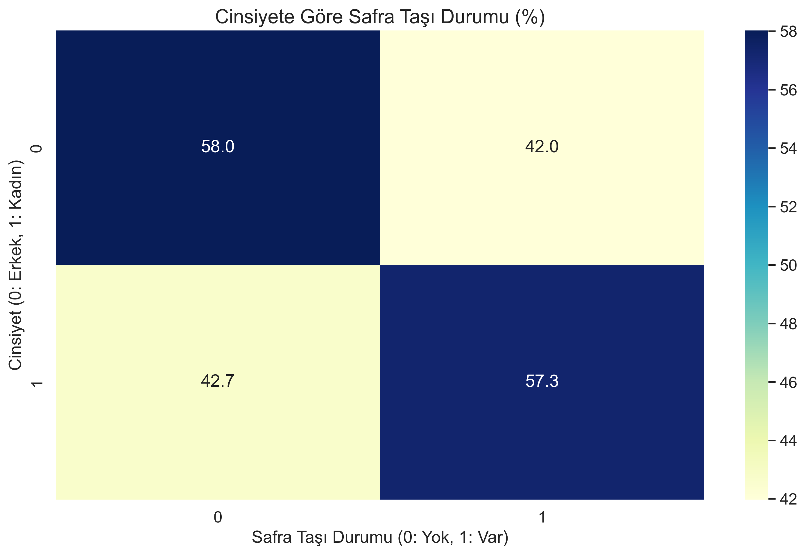
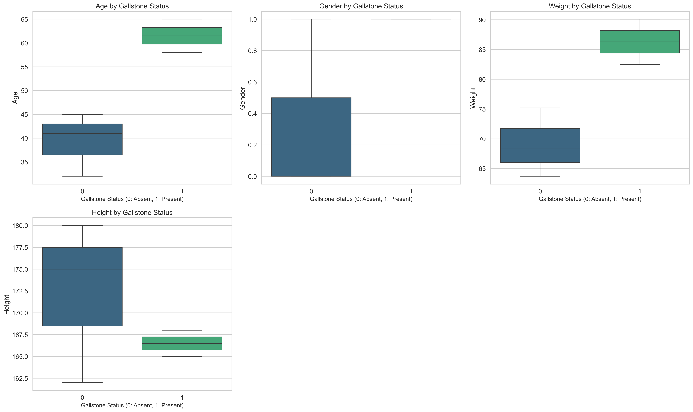
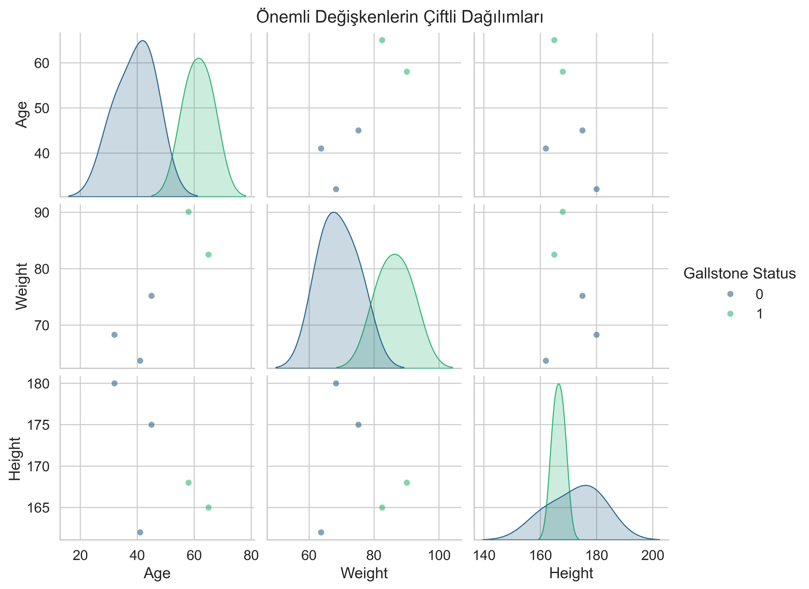
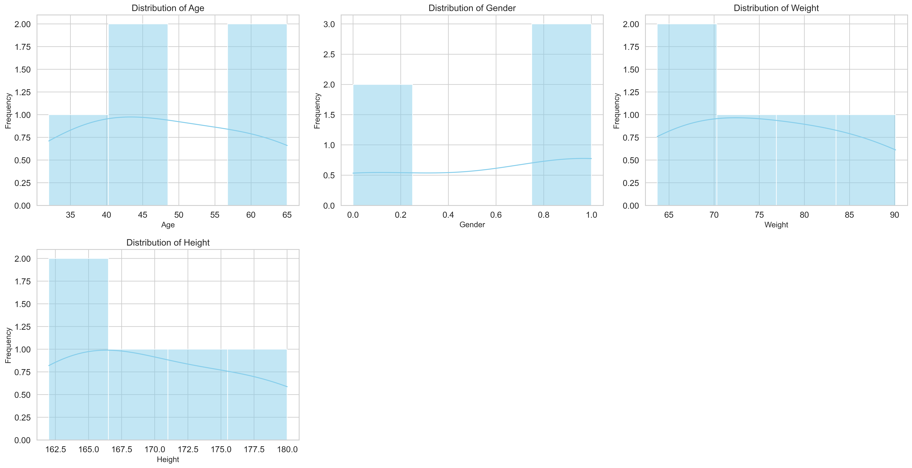

# 🩺 Safra Taşı Hastalığı (Gallstone-1) Veri Seti Analizi

## 1. Giriş

Safra taşı hastalığı (*cholelithiasis*), dünya genelinde sık karşılaşılan bir gastrointestinal bozukluktur. Geleneksel tanı yöntemleri (USG, BT, MRG) hem yüksek maliyetlidir hem de bazı hasta gruplarında sınırlı doğruluk sağlayabilir. Bu sebeple, alternatif ve maliyeti düşük tanı yöntemlerinin geliştirilmesi büyük önem taşımaktadır.

Bu projede analiz edilen **Gallstone-1 veri seti**, biyolojik empedans ve laboratuvar verilerini içeren, etik onaylı ve dengeli bir klinik veri kümesidir. Veri seti, makine öğrenmesi ve istatistiksel analizler için uygun bir temel sunmaktadır.

---

## 2. Veri Seti Tanımı

- **Kaynak:** Ankara VM Medical Park Hastanesi, İç Hastalıkları Polikliniği  
- **Toplama Dönemi:** Haziran 2022 – Haziran 2023  
- **Örnek Sayısı:** 319 birey (161 safra taşı hastası, 158 sağlıklı kontrol)  
- **Özellik Sayısı:** 38 (demografik, biyolojik empedans ve laboratuvar verileri)  
- **Eksik Veri:** Yok  
- **Etik Onay:** Ankara Şehir Hastanesi Etik Kurulu (E2-23-4632)  

Veri setinde yaş, cinsiyet, boy, kilo, BMI gibi demografik bilgiler; toplam vücut suyu, kas/yağ kütlesi, protein, visseral yağ, hepatik yağ gibi empedans verileri; ve ayrıca glukoz, kolesterol, trigliserid, AST, ALT, kreatinin, CRP, hemoglobin, D vitamini gibi laboratuvar test sonuçları yer almaktadır.

---

## 3. Görsel Analizler ve Bulgular

### 3.1. Yaş Dağılımı ve Safra Taşı İlişkisi

📊 Yaş arttıkça safra taşı görülme olasılığı artmaktadır. Özellikle 60 yaş ve üzeri bireylerde bu oran daha da belirginleşmiştir.

### 3.2. Değişkenler Arası Korelasyon Analizi

🔥 Korelasyon ısı haritası sonuçlarına göre:
- Yaş ve kilo yüksek korelasyon göstermektedir (≈0.88).
- Cinsiyet orta düzeyde etkilidir.
- Boy ise safra taşıyla en az ilişkili değişkendir.

### 3.3. Cinsiyet ve Safra Taşı Dağılımı

👨‍🦰 Erkek bireylerde safra taşı görülmemiştir.  
👩 Kadın bireylerin %66.7’sinde safra taşı tespit edilmiştir.  
Bu durum, biyolojik ve hormonal farklılıkların etkili olduğunu düşündürmektedir.

### 3.4. Boxplot Analizi

📦 Safra taşı olan bireylerde yaş ve kilo median değerleri daha yüksektir. Boy ve cinsiyet farklılıkları daha az belirgindir.

### 3.5. Çiftli Değişken Dağılımı (Pairplot)

🔍 Yaş ve kilo kombinasyonları, safra taşı olan bireylerde belirgin kümelenmelere yol açmaktadır. Bu değişkenler, sınıflandırma modelleri için önemli ayırt edici özellikler olabilir.

### 3.6. Sayısal Dağılım Grafikleri

📈 Yaş ve kilo değişkenleri pozitif çarpıklık göstermektedir. Bu durum, ön işleme (örneğin log dönüşümü) gerektirebilir.

---

## 4. Değerlendirme ve Öneriler

### 4.1. Bulguların Özeti
- Yaş ve kilo, safra taşı hastalığında en belirleyici değişkenlerdir.
- Kadın bireylerde safra taşı görülme oranı belirgin şekilde yüksektir.
- Boy değişkeni düşük etkiye sahiptir.

### 4.2. Öneriler
- Sınıflandırma modellerinde özellikle yaş ve kilo değişkenlerine odaklanılmalıdır.
- Veri seti küçük olduğundan daha geniş örneklem ile çalışmalar tekrarlanmalıdır.
- Kadınlar için yaş/kilo tabanlı erken uyarı sistemleri geliştirilebilir.
- Karar ağaçları, regresyon gibi yöntemlerle tahmin sistemleri geliştirilebilir.

---

## 5. Sonuç

Bu çalışma, safra taşı hastalığının bazı temel biyometrik ve demografik değişkenlerle güçlü ilişkiler gösterdiğini ortaya koymuştur. Yaş, cinsiyet ve kilo faktörleri, özellikle risk sınıflandırması açısından ön plandadır. Veri setinin sınırlı büyüklüğüne rağmen yapılan analizler, sağlık alanında erken teşhis ve koruyucu önlem planlamaları için kullanılabilir.

---

## 6. 📊 Katkılar ve Kaynaklar

- Bu projede kullanılan tüm **grafikler ve analizler tarafımdan Python kullanılarak** oluşturulmuştur.
- Kullanılan temel kütüphaneler:
  - `pandas`, `numpy`
  - `matplotlib`, `seaborn`
- Veri seti: **Gallstone-1 (Safra Taşı)**
- Kodlara erişim:
  > 🔗 [Gallstone Dataset Analysis Project – GitHub Repository](https://github.com/mehmetkahya0/Gallstone_dataset_analysis_project)
  

  Created by Mehmet Kahya.

---

**Not:** Bu proje yalnızca akademik/öğrenim amaçlıdır.
